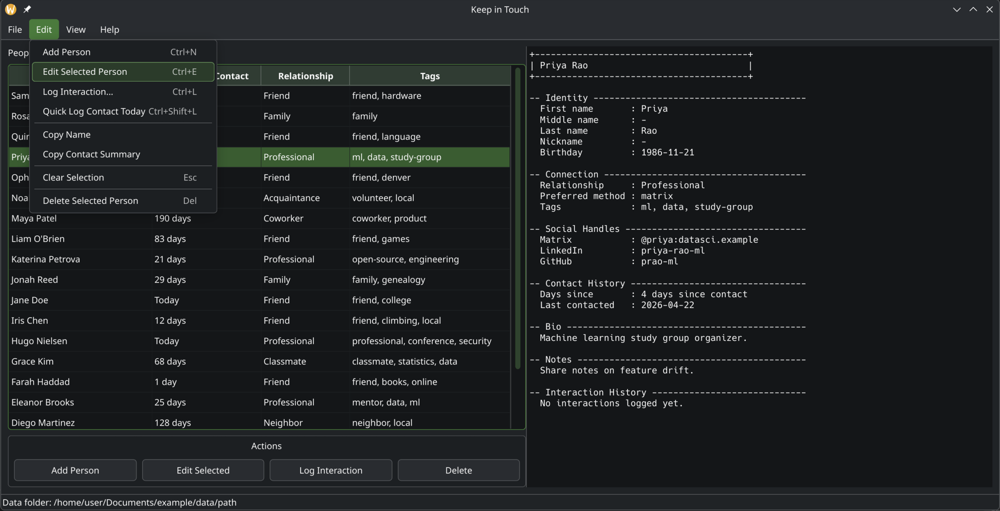

# Keep in Touch

**Keep in Touch** is a simple, local-first desktop app for keeping track of personal relationships.

<p align="center">
  
</p>
(Note this is just randomly generated example data.)


It helps you remember who you care about, when you last reached out, what you talked about, and when it may be time to reconnect.

The goal is not to replace your contacts app, calendar, notes app, or a full CRM. Keep in Touch is designed to be a lightweight personal tool for staying intentional about the people in your life.

## What it does

Keep in Touch gives you a clean list of people you want to stay connected with. Each person can have basic details, notes, relationship context, preferred contact method, social handles, and contact history.

The app shows how long it has been since you last contacted someone based on the last logged interaction.

You can use it to:

- Track friends, classmates, family, coworkers, mentors, and other personal connections
- See how long it has been since you last contacted someone
- Log conversations, calls, texts, or in-person interactions
- Keep notes that help you have more thoughtful future conversations
- Export your data for backup or analysis

## Why use it?

Modern life makes it easy to lose touch with people unintentionally. Keep in Touch gives you a small, private place to manage those relationships without relying on a cloud service or complicated CRM.

It is designed for people who want something simple, portable, and personal.

## Privacy

Keep in Touch is local-first.

Your data is stored on your own computer as plain text files. There is no account, no cloud sync, and no external service required.

You are responsible for backing up and protecting your own data, just like any other local files.

## Getting started

### Requirements

You need Python installed on your computer.

Recommended:

```bash
python --version
```

Python 3.11 or newer is recommended.

### Install and run

Clone the repository:

```bash
git clone https://github.com/YOUR-USERNAME/keep-in-touch.git
cd keep-in-touch
```

Create a virtual environment:

```bash
python -m venv .venv
```

Activate it.

On macOS or Linux:

```bash
source .venv/bin/activate
```

On Windows PowerShell:

```powershell
.venv\Scripts\Activate.ps1
```

Install the app dependencies:

```bash
python -m pip install -r requirements-dev.txt
```

Run the app:

```bash
python run_app.py
```

## Using the app

When you open Keep in Touch, you will see a list of people and how many days it has been since you last contacted each person.

You can:

- Add a person
- Edit a person by double-clicking their row
- Right-click a person for quick actions
- Log an interaction
- Mark that you contacted someone today
- Export your people or interaction history to CSV

Each time you log an interaction, the app updates that person’s last-contacted date.

## Data and backups

Keep in Touch stores your information locally in a data folder on your computer.

The data is intentionally easy to back up, copy, inspect, and export. You can keep the data folder in a normal backup system, external drive, or synced folder if you choose.

CSV export is available from the app for people and interaction history.

## Project status

Keep in Touch is in early development.

The current focus is a clean, reliable desktop experience for personal relationship tracking. Future improvements may include better search, richer filtering, improved import tools, reminders, and packaging for easier installation.
