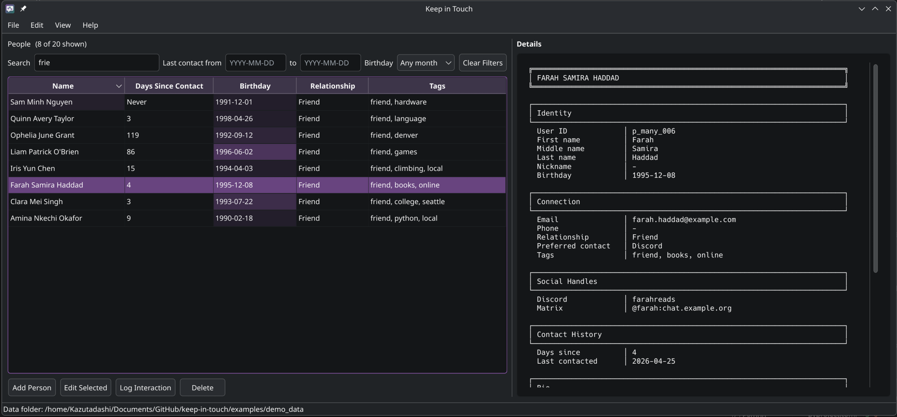

# Keep in Touch

**Keep in Touch** is a local-first desktop application for maintaining personal relationship context. It gives you a structured place to remember who someone is, where you usually talk to them, when you last connected, what you discussed, and when to follow up. The project is intentionally modest in scope: it is not a CRM, calendar, contacts replacement, or cloud service. It is a focused personal tool for people who want a private, durable record of their real-world and online connections.

<p align="center">
  
</p>

The screenshot uses generated example data, but it reflects the shape of the application. People are listed in a sortable table with practical fields such as name, days since last contact, birthday, relationship, and tags. Selecting a person opens a text-based detail panel with identity fields, contact information, social handles, notes, and interaction history. The interface is designed for quick scanning first and deeper context second.

Keep in Touch stores data in plain JSON Lines files inside a folder you choose. That design keeps the project easy to inspect, back up, version, import, export, and analyze with external tools. The schema favors simple, data-science-friendly fields: dates are stored in ISO format, relationship categories and preferred contact methods are plain strings, tags are lists, social handles are dictionaries, and contact history is represented as separate interaction records.

## Features

Keep in Touch tracks people, relationship context, preferred contact methods, direct contact fields, social handles, birthdays, notes, and interaction history. The main table supports sorting, including sorting by days since last contact so you can quickly find people you have not contacted recently. Birthdays are shown as ISO dates and visually decorated by proximity, making current and upcoming birthdays easy to notice without turning the table into a reminder system.

The app supports local JSONL storage, generic CSV and JSONL import for people, CSV and JSONL export for people and interactions, editable interaction history, and a loadable demo data folder. Interaction records update each person's last-contacted date, and editing or deleting interactions recalculates that value from the remaining history.

## Privacy

Keep in Touch is local-first. There is no account system, hosted backend, telemetry pipeline, or cloud synchronization layer. Your data lives in the data folder you select, using portable text files that can be backed up by ordinary file backup tools. This also means you are responsible for protecting that folder if it contains sensitive personal information.

## Installation

Python 3.11 or newer is recommended. Clone the repository, create a virtual environment, install the development requirements, and run the app from the repository root.

```bash
git clone https://github.com/Kazutadashi/keep-in-touch
cd keep-in-touch
python -m venv .venv
source .venv/bin/activate
python -m pip install -r requirements-dev.txt
python run_app.py
```

On Windows PowerShell, activate the virtual environment with `.venv\Scripts\Activate.ps1` before installing requirements and running `python run_app.py`.

## Usage

When the application opens, choose `File > Set Data Folder...` and select or create a folder where Keep in Touch should store its data. The app will create the expected layout in that folder, including `people.jsonl`, `interactions.jsonl`, `settings.json`, `exports/`, and `backups/`. After that, you can add people, edit a person by double-clicking their row, log interactions, update interaction history from the edit-person dialog, and export your data for backup or analysis.

To try the project with ready-made sample data, choose `File > Set Data Folder...` and select `examples/demo_data`. That directory already uses the normal app data-folder layout, so the example people and interactions appear immediately without any import step.

## Data Model

The project is built around two primary records: people and interactions. People contain stable identity and relationship information, while interactions record dated contact events. Keeping those concerns separate makes the data easier to analyze later. For example, a simple script can count relationship types, measure direct contact field coverage, inspect social platform usage, find the oldest contact dates, or rank upcoming birthdays without scraping UI text.

Unknown fields from newer or older versions are preserved where possible through `extra_fields`, so changing the schema does not need to destroy user data. New first-class fields should still be added intentionally across the model, serialization, import/export, UI, examples, and tests. See [Adding a New Field](docs/adding-new-field.md) for the full walkthrough.
